# LAB 02: Deploy FoodExpress Application on AWS EC2 Using VPC, Public Subnets, Private Subnets and Internet Gateway

## Objective

In Lab 01, we designed the AWS network architecture for the FoodExpress application.

We analyzed:

* Business Requirements
* Future Growth
* Capacity Planning
* CIDR Planning
* Subnet Planning
* IPv4 Address Allocation
* IPv6 Planning

In this lab, we will implement the network design and deploy the FoodExpress application.

By completing this lab, you will learn how to:

* Create an AWS VPC
* Create Public Subnets
* Create Private Subnets
* Create and Attach an Internet Gateway
* Configure Route Tables
* Launch EC2 Instances
* Deploy a Web Application on EC2
* Understand Public vs Private Subnets
* Verify Internet Connectivity
* Understand Why Private Instances Cannot Be Accessed from the Internet

---

# Prerequisites

Before starting this lab ensure:

* AWS Account
* IAM User with EC2 and VPC Permissions
* Lab 01 Completed
* FoodExpress Application Files Available

Application Files:

```text
index.html
style.css
app.js
```

---

# Application Overview

FoodExpress is a simple food ordering application.

Application Features:

* Display Available Food Items
* Place Order
* Show Success Message

Current Application Architecture:

```text
Customer
    |
Internet
    |
FoodExpress Website
```

Target AWS Architecture:

```text
Internet
    |
Internet Gateway
    |
--------------------------------
FoodExpress VPC
10.0.0.0/16
--------------------------------

Public Subnet A
10.0.1.0/24
     |
     |--- Web Server 1

Public Subnet B
10.0.2.0/24
     |
     |--- Web Server 2

Private Subnet A
10.0.10.0/24

Private Subnet B
10.0.20.0/24
```

---

# PHASE 1 - CREATE VPC

## Step 1 - Create VPC

Navigate:

```text
AWS Console
→ VPC
→ Create VPC
```

Configuration:

```text
Name:
foodexpress-vpc

IPv4 CIDR:
10.0.0.0/16
```

Click:

```text
Create VPC
```

Expected Result:

```text
VPC Created Successfully
```
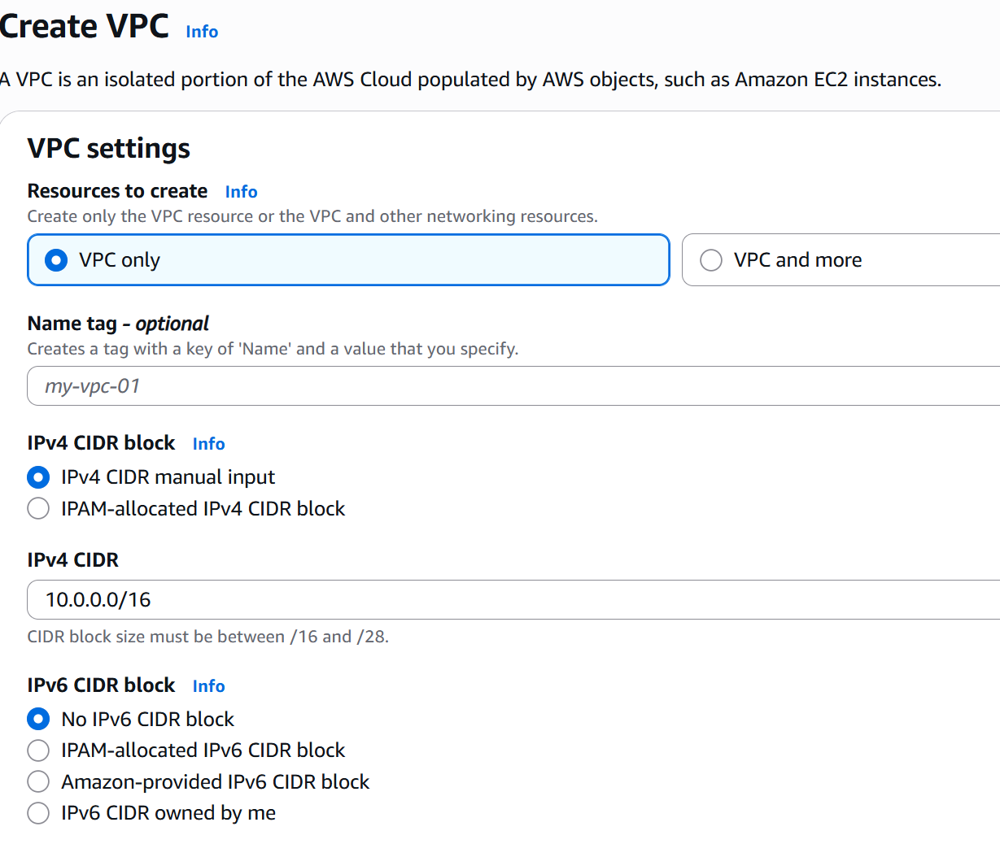
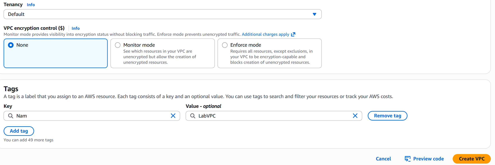

---

## Step 2 - Verify VPC

Navigate:

```text
VPC
→ Your VPCs
```

Verify:

```text
CIDR:
10.0.0.0/16
```

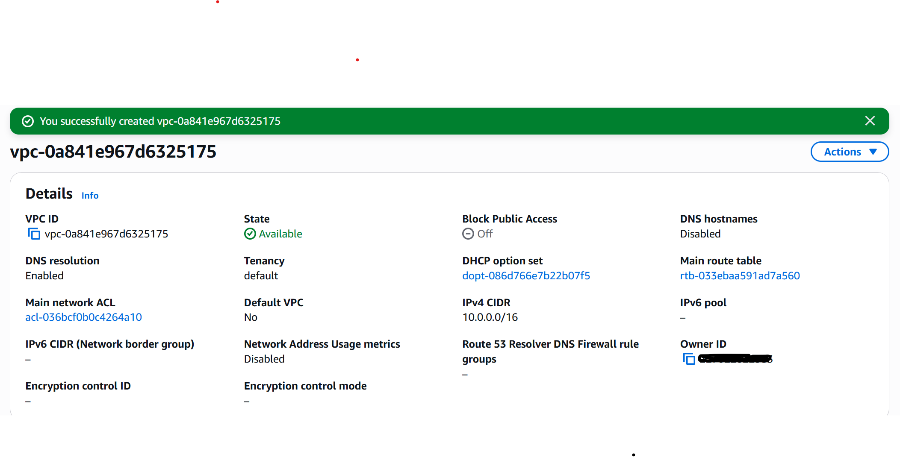
---

# PHASE 2 - CREATE SUBNETS

## Step 3 - Create Public Subnet A

Configuration:
Click on Subents
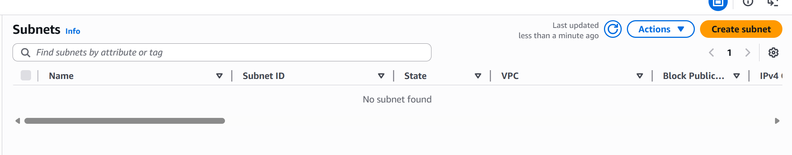

Click on Create subnet
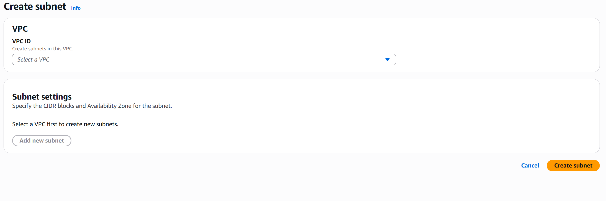

```text
Name:
public-subnet-a

CIDR:
10.0.1.0/24

Availability Zone:
use1-az1
```

Expected Result:

```text
Public Subnet A Created
```
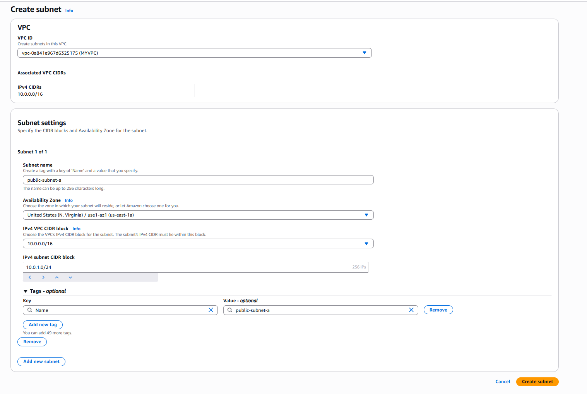
---

## Step 4 - Create Public Subnet B

Configuration:

```text
Name:
public-subnet-b

CIDR:
10.0.2.0/24

Availability Zone:
ap-south-1b
```

Expected Result:

```text
Public Subnet B Created
```
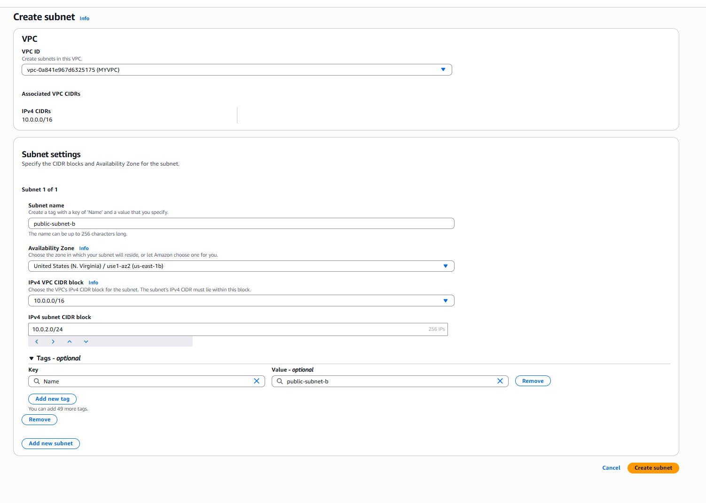
---

## Step 5 - Create Private Subnet A

Configuration:

```text
Name:
private-subnet-a

CIDR:
10.0.10.0/24

Availability Zone:
ap-south-1a
```
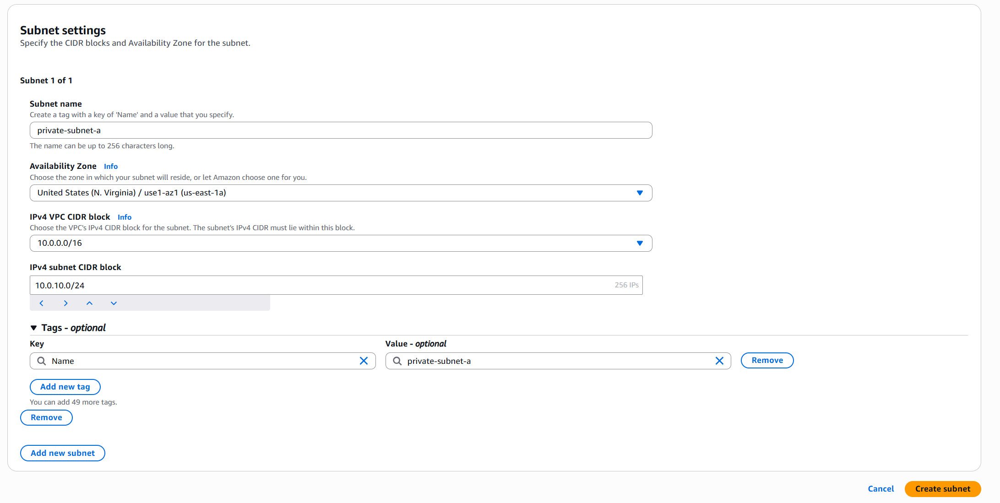
---

## Step 6 - Create Private Subnet B

Configuration:

```text
Name:
private-subnet-b

CIDR:
10.0.20.0/24

Availability Zone:
ap-south-1b
```
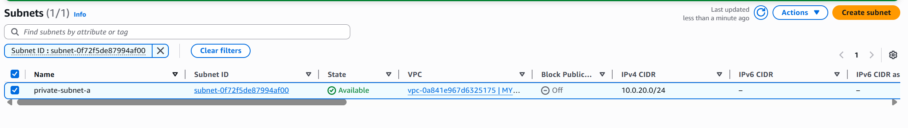
---

## Step 7 - Verify Subnets

Verify:

| Subnet    | CIDR         |
| --------- | ------------ |
| Public-A  | 10.0.1.0/24  |
| Public-B  | 10.0.2.0/24  |
| Private-A | 10.0.10.0/24 |
| Private-B | 10.0.20.0/24 |

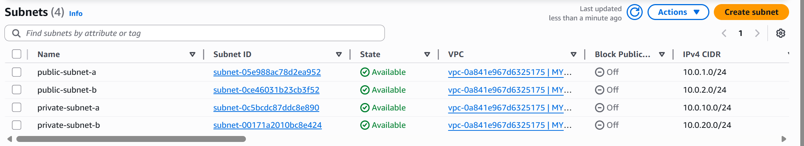
---

# PHASE 3 - CREATE INTERNET GATEWAY

## Step 8 - Create Internet Gateway

Navigate:

```text
VPC
→ Internet Gateways
→ Create Internet Gateway
```

Configuration:

```text
Name:
foodexpress-igw
```

Click:

```text
Create
```
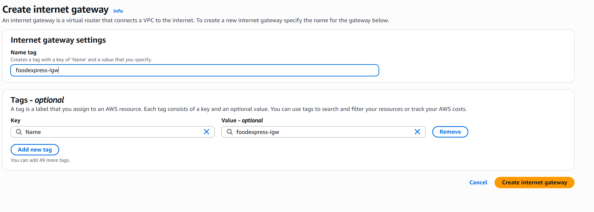
---

## Step 9 - Attach Internet Gateway

Select:

```text
foodexpress-igw
```

Choose:

```text
Attach to VPC
```
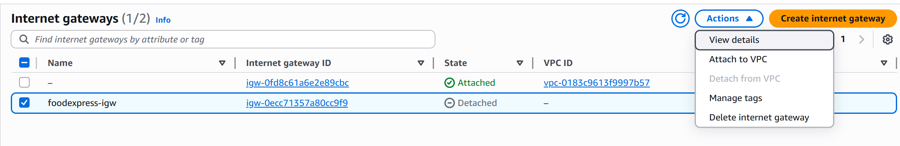
Select:

```text
foodexpress-vpc
```
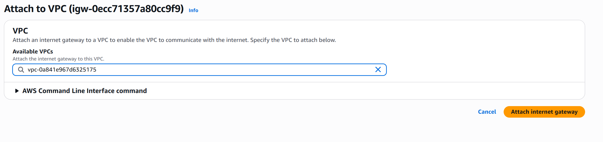
Expected Result:

```text
Internet Gateway Attached Successfully
```
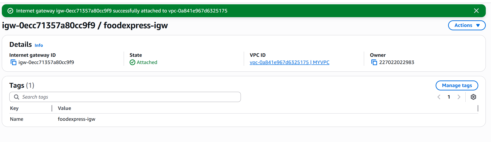
---

# PHASE 4 - CREATE ROUTE TABLES

## Step 10 - Create Public Route Table

Navigate:

```text
Route Tables
→ Create Route Table
```

Configuration:

```text
Name:
public-rt
```


 ## Step 11 - Add Internet Route

Edit Routes:

Add:

```text
Destination:
0.0.0.0/0

Target:
foodexpress-igw
```

Save.

Meaning:

```text
Send all internet traffic to IGW
```
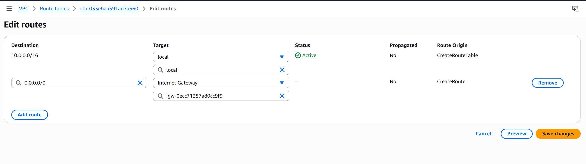
---

## Step 12 - Associate Public Subnets

Associate:

```text
public-subnet-a
public-subnet-b
```

Expected Result:

```text
Public Subnets Can Reach Internet
```
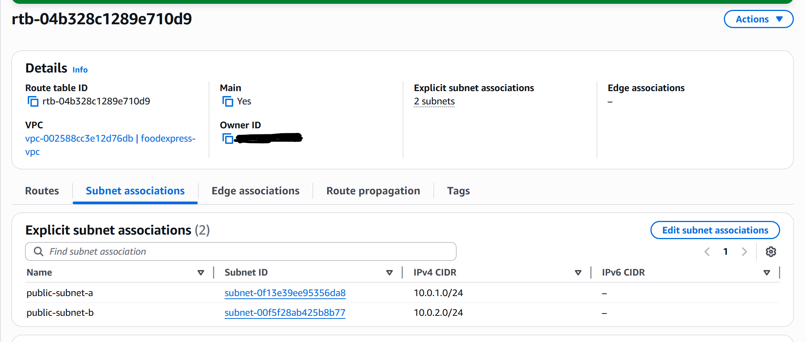
---

## Step 13 - Create Private Route Table

Create:

```text
private-rt
```

Do NOT add:

```text
0.0.0.0/0
```

Do NOT attach:

```text
Internet Gateway
```
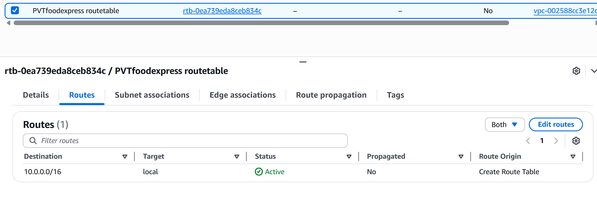
Associate:

```text
private-subnet-a
private-subnet-b
```

Expected Result:

```text
Private Subnets Have No Internet Access
```
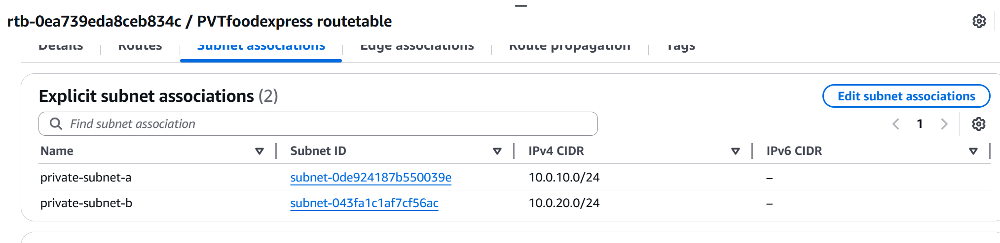
---

# PHASE 5 - LAUNCH EC2 INSTANCES

## Step 14 - Launch Web Server 1

Configuration:

```text
Name:
foodexpress-web-01

Subnet:
public-subnet-a

Auto Assign Public IP:
Enabled
```

AMI:

```text
Amazon Linux 2023
```

Instance Type:

```text
t2.micro
```

Security Group:

```text
HTTP 80
SSH 22

Source:
0.0.0.0/0
```

Launch Instance.
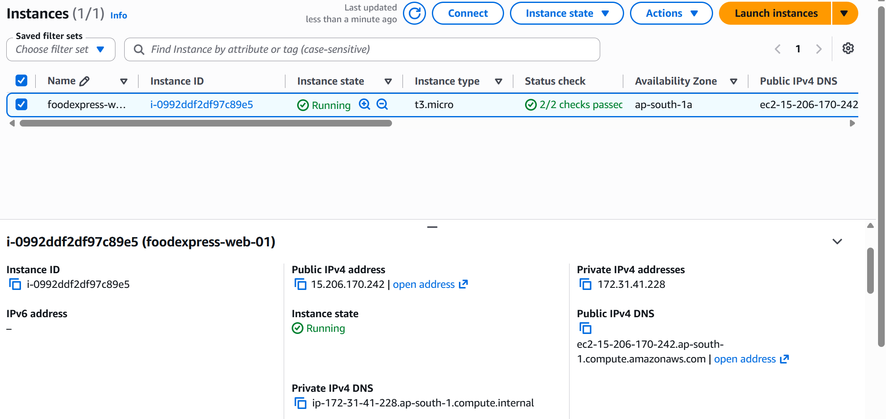
---

## Step 15 - Launch Web Server 2

Configuration:

```text
Name:
foodexpress-web-02

Subnet:
public-subnet-b

Auto Assign Public IP:
Enabled
```

Launch Instance.

---

## Step 16 - Launch Private Instance

Configuration:

```text
Name:
foodexpress-private-test

Subnet:
private-subnet-a

Auto Assign Public IP:
Disabled
```

Launch Instance.

Purpose:

```text
Demonstrate Private Subnet Behavior
```
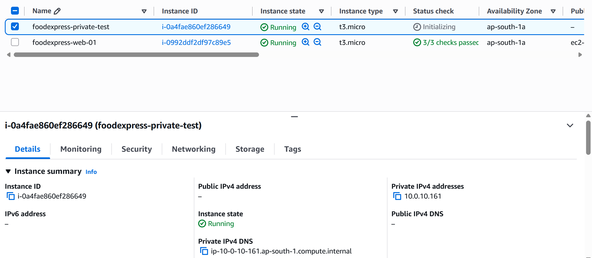
---

# PHASE 6 - DEPLOY APPLICATION

## Step 17 - Connect to Web Server

SSH into:

```bash
ssh -i key.pem ec2-user@PUBLIC-IP
```
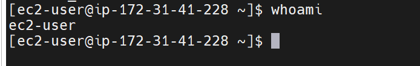
---

## Step 18 - Install NGINX

Execute:

```bash
sudo dnf update -y

sudo dnf install nginx -y

sudo systemctl enable nginx

sudo systemctl start nginx
```

Verify:

```bash
systemctl status nginx
```

Expected Result:

```text
active (running)
```
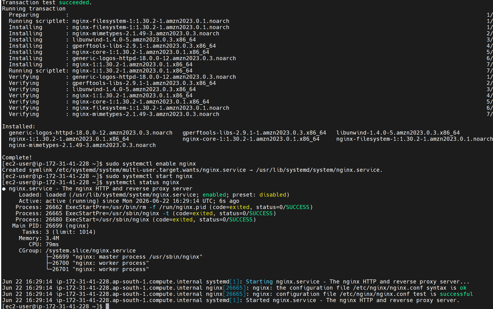
---

## Step 19 - Deploy FoodExpress Files

Navigate:

```bash
cd /usr/share/nginx/html
```

Remove Default Page:

```bash
sudo rm -rf *
```

Copy:

```text
index.html
style.css
app.js
```

to:

```bash
/usr/share/nginx/html
```
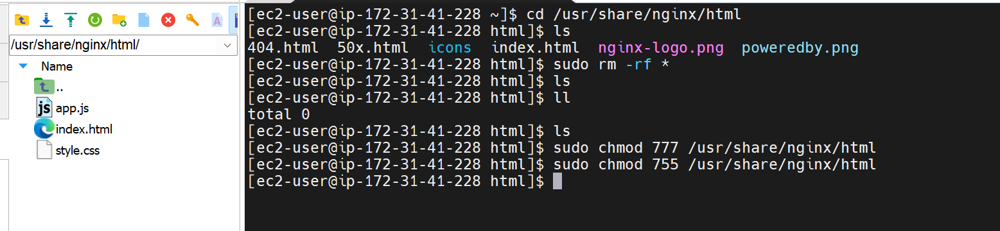
---

## Step 20 - Verify Application

Open Browser:

```text
http://PUBLIC-IP
```

Expected Result:

```text
FoodExpress Homepage Displayed
```

Verify:

* Pizza
* Burger
* Biryani
* Pasta

Click:

```text
Place Order
```

Expected Result:

```text
Order Placed Successfully
```
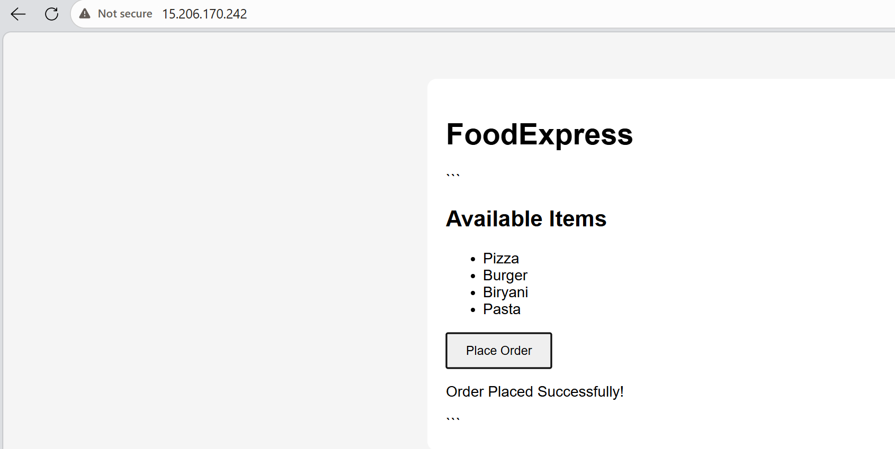
---

# PHASE 7 - DEMONSTRATE PUBLIC SUBNET

## Step 21 - Verify Public Access

Open:

```text
http://WEB-SERVER-01-PUBLIC-IP
```

Expected Result:

```text
Application Accessible
```

Reason:

```text
Public Subnet
+
Public IP
+
Internet Gateway
+
Route Table
```

---

# PHASE 8 - DEMONSTRATE PRIVATE SUBNET

## Step 22 - Verify Private Instance

Open:

```text
Private IP Address
```

Example:

```text
10.0.10.50
```

Attempt Access:

```text
http://10.0.10.50
```

Expected Result:

```text
Connection Failed
```

---

## Step 23 - Why Did Access Fail?

Private Instance Has:

```text
Private IP
```

But Does Not Have:

```text
Public IP
Internet Gateway Route
```

Therefore:

```text
Internet Cannot Reach Instance
```
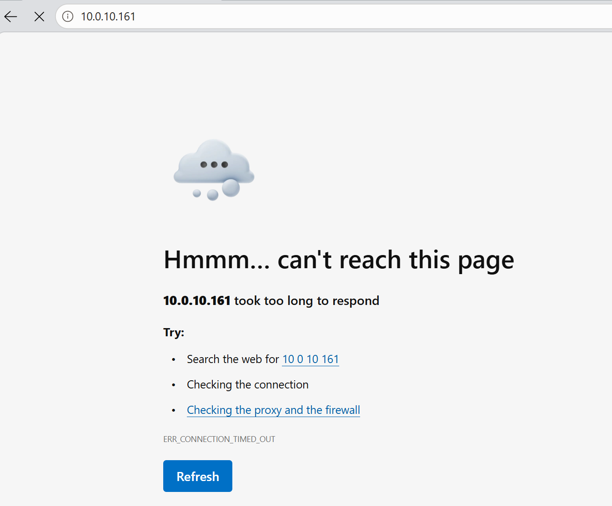
---

# Traffic Flow Analysis

## Public Instance

```text
Browser
   |
Internet
   |
Internet Gateway
   |
Public Route Table
   |
Public Subnet
   |
EC2 Instance
```

Connection Successful.

---

## Private Instance

```text
Browser
   |
Internet
   |
Internet Gateway
   |
NO ROUTE
   |
Private Subnet
```

Connection Failed.

Now we can test one thing we are removing the route to IGW in public Route Table and validate we can access the site or not

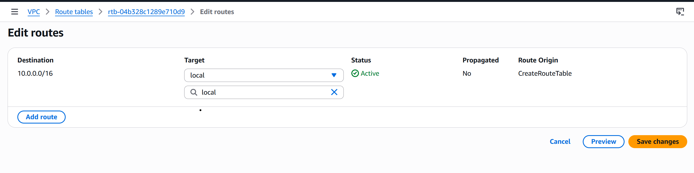


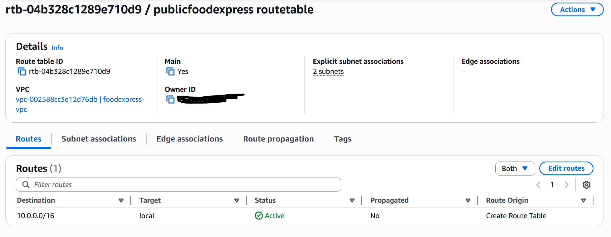

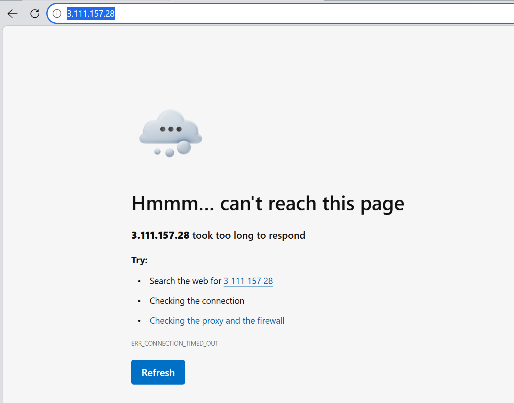

# Verification Checklist

| Verification                    | Status |
| ------------------------------- | ------ |
| VPC Created                     | ✓      |
| Public Subnets Created          | ✓      |
| Private Subnets Created         | ✓      |
| Internet Gateway Created        | ✓      |
| Internet Gateway Attached       | ✓      |
| Public Route Table Created      | ✓      |
| Public Route Added              | ✓      |
| EC2 Deployed in Public Subnet   | ✓      |
| EC2 Deployed in Private Subnet  | ✓      |
| NGINX Installed                 | ✓      |
| FoodExpress Deployed            | ✓      |
| Public Access Verified          | ✓      |
| Private Access Failure Verified | ✓      |
| Traffic Flow Understood         | ✓      |

---

# Expected Outcome

After successful completion of this lab:

* A production-style VPC was created.
* Public and Private subnets were implemented.
* Internet Gateway was configured.
* Route Tables were configured.
* EC2 instances were launched.
* FoodExpress was deployed on EC2.
* Public subnet internet access was verified.
* Private subnet isolation was demonstrated.
* Traffic flow between Internet, IGW, Route Tables and EC2 instances was understood.

This lab establishes the foundation for the next networking labs:

* NAT Gateway
* Bastion Host
* Security Groups
* Network ACLs
* Load Balancer
* Auto Scaling Group
* Route Table Deep Dive
* Multi-Tier Production Architecture
